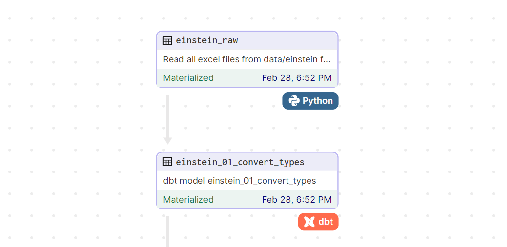

## A Pipeline CI/CD
A Pipeline de CI/CD (Continuous Integration/Continuous Deployment) é um processo que realiza o deploy automático do código no ambiente de produção (servidor).
Ela está configurada no arquivo `.github/workflows/deploy.yaml`  e utiliza o recurso de **GitHub Actions** disponível no GitHub.

### Execução da Pipeline
A pipeline de deploy é ativada automaticamente de acordo com as regras definidas no arquivo de configuração.
Por padrão, está configurada para executar mediante qualquer push (commits, merges) na branch `main`

### Como funciona?
Uma vez iniciada, o GitHub provisiona máquinas para executar os passos definidos no arquivo de configuração. Após a execução, as máquinas são deprovisionadas.

## Configurar a Pipeline CI/CD

### Clonar o repositório no servidor

Criar um usuário no servidor. Acessar home do usuário `cd ~`

`git clone https://github.com/InstitutoTodosPelaSaude/arbo`

### Configurar chaves ssh

Gerar par de chaves ssh para o usuário com `ssh-keygen`

Copiar a chave pública no arquivo `~/.ssh/authorized_hosts`

Copiar a chave privada e criar github secret do repositório arbo[link]

Settings > Actions > Secrets and variables > Secrets

Criar os secrets:

| HOST_IP | Ip do servidor |
| --- | --- |
| HOST_IP | Ip/hostname do server |
| HOST_USER | Usuário ssh |
| SSH_PRIVATE_KEY | Chave privada |

⚠️ IMPORTANTE - Garantir que as informações estão sendo criadas como SECRET no Github


## Estrutura do projeto

### Serviços
| Serviço               | Descrição                                         |
| :---:                 | :---:                                             |
| Postgres              | Banco de dados que armazena todas as etapas de            processamento de dados, além do histórico de processamento das pipelines do Dagster|
| Dagster + DBT         | Ferramenta de orquestração de tarefas, responsável por executar as etapas de processamento de dados e as automações implementadas  |
| Streamlit             | Frontend da aplicação Arbo, proporciona a interação com a pipeline e visualização de gráficos sincronizados ao banco de dados da pipeline |
| Nginx                 | Proxy reverso responsável pelo controle das rotas e autenticação                                                                |
| xlsx2csv              | API para converter arquivos XLSX para CSV sem comprometer o formato das datas                                                         |

### Arquivos de configuração


| Arquivo           | Objetivo                        | Serviços que usam |
| :---:             | :---:                           | :---:             |
| postgres/.env     | criada a partir do postgres/.env.example, configura o user e senha do banco de dados.                              | Postgres          |
| postgres/create_database.sql | criada a partir do postgres/create_database_example.sql, deve ser configurada as credenciais dos usuários itps_dev e dagster para o banco de dados              | Postgres          |
| dbt/profiles.yml  | criada a partir do dbt/profiles_example.yml, configura a conexão do banco de dados pelo DBT, assim como seleciona o banco de produção ou desenvolvimento                                       | DBT
| .env              | criada a partir do arquivo .env.example, configura o banco de dados a ser acessado pelos códigos Python e pelo Dagster. Além disso, também configura as credenciais de acesso na autenticação do frontend| Dagster+DBT, Nginx, Streamlit           |

## FAQ Contribuições

### Como criar uma nova DAG?
1. Na pasta ```dagster/```, execute o seguinte comando, colocando o nome da dag em ```<DAG_NAME>```:
    ```sh
    dagster-dbt project scaffold --project-name <DAG_NAME> --dbt-project-dir ../dbt
    ```

2. Com a pasta do projeto criada, adicione o projeto ao arquivo ```workspace.yaml```, seguindo o padrão:
    ```txt
    - python_module:
        module_name: <DAG_NAME>.definitions
        working_directory: dagster/<DAG_NAME>
    ```

3. Agora, filtre os models do DBT que farão parte da DAG. Acesse o arquivo ```dagster/<DAG_NAME>/<DAG_NAME>/assets.py``` e adicione o argumento ```select``` no decorator ```@dbt_assets```:
    ```py
    @dbt_assets(
            manifest=dbt_manifest_path, 
            select='einstein'
    )
    def arboviroses_dbt_assets(context: AssetExecutionContext...
    ```
    ⚠️ o argumento ```select``` pode receber vários tipos de filtro, seguindo o [padrão do DBT](https://docs.getdbt.com/reference/node-selection/syntax#specifying-resources). No exemplo acima, serão selecionados os modelos em ```dbt/models/einstein/```.

4. Por fim, permita a visualização dos testes do DBT no Dagster. Vá ao arquivo ```dagster/<DAG_NAME>/<DAG_NAME>/assets.py``` e siga os seguintes passos:
    
    4.1. Importe as dependências:
    ```py
    from dagster_dbt import (
        ...,
        DagsterDbtTranslator,
        DagsterDbtTranslatorSettings
    )
    ```
    
    4.2. Adicione o código:
    ```py
    dagster_dbt_translator = DagsterDbtTranslator(
        settings=DagsterDbtTranslatorSettings(enable_asset_checks=True)
    )
    ```

    4.3. Adicione a variável ```dagster_dbt_translator``` ao argumento ```dagster_dbt_translator``` do decorator ```@dbt_assets```:
    ```py
    @dbt_assets(manifest=dbt_manifest_path, 
                select='einstein',
                dagster_dbt_translator=dagster_dbt_translator
    )
    def arboviroses_dbt_assets(context: AssetExecutionContext...
    ```

### Como conectar um asset DBT à um asset Python?
Para conectar um asset DBT à um asset Python, como na figura abaixo, siga os seguintes passos:



1. Acesse o arquivo ```dbt/models/<PROJECT_NAME>/<PROJECT_NAME>.yml```;
2. Adicione uma ```source``` seguindo o padrão abaixo:
    ```yml
    sources:
        - name: dagster
            description: ...
            schema: <DB_SCHEMA>
            tables:
                - name: <PYTHON_ASSET_NAME>
                    meta: 
                        dagster:
                            asset_key: ["<PYTHON_ASSET_NAME>"]
    ```
3. No DBT model que se conectará ao asset Python, siga o exemplo abaixo para importar os dados:
    ```sql
    {{ config(materialized='table') }}

    WITH source_data AS (

        SELECT * FROM
        {{ source("dagster", "<PYTHON_ASSET_NAME>") }}

    )
    ```

### Como conectar um asset Python à um asset DBT?
Para conectar um asset Python à um asset DBT, como na figura abaixo, siga os seguintes passos:


1. Acesse o arquivo ```dagster/<DAG_NAME>/<DAG_NAME>/assets.py```;

2. Importe as dependências:
    ```py
    from dagster_dbt import (
        ...,
        get_asset_key_for_model
    )
    ```

3. Usando o ```get_asset_key_for_model```, adicione o asset DBT ao argumento ```deps``` do decorator ```@asset``` do asset Python:
    ```py
    @asset(
        compute_kind="python", 
        deps=[get_asset_key_for_model([arboviroses_dbt_assets], "<DBT_ASSET_NAME>")]
    )
    def einstein_remove_used_files(context...
    ```